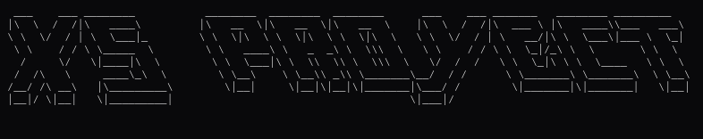

# XSProyect'

<p align="center">
  
</p>

1. **Clonar el repositorio:**
   ```bash
   git clone https://github.com/The2GrayHat/XSProyect
   
   cd XSProyect

2. **instalar requerimientos**
   ```bash
   pip install -r requirements

3. **ejecutar**
   ```bash
   python XSPy.py
